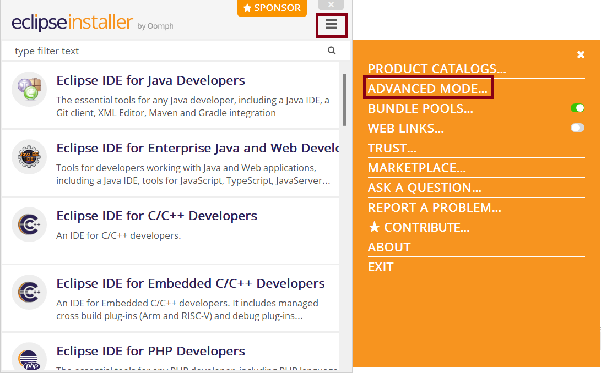
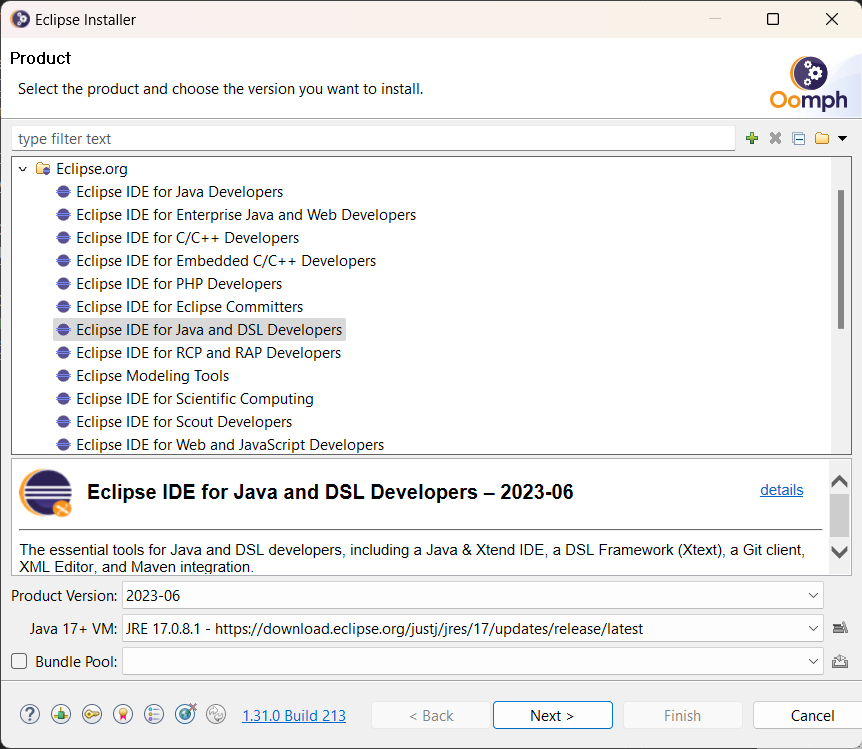
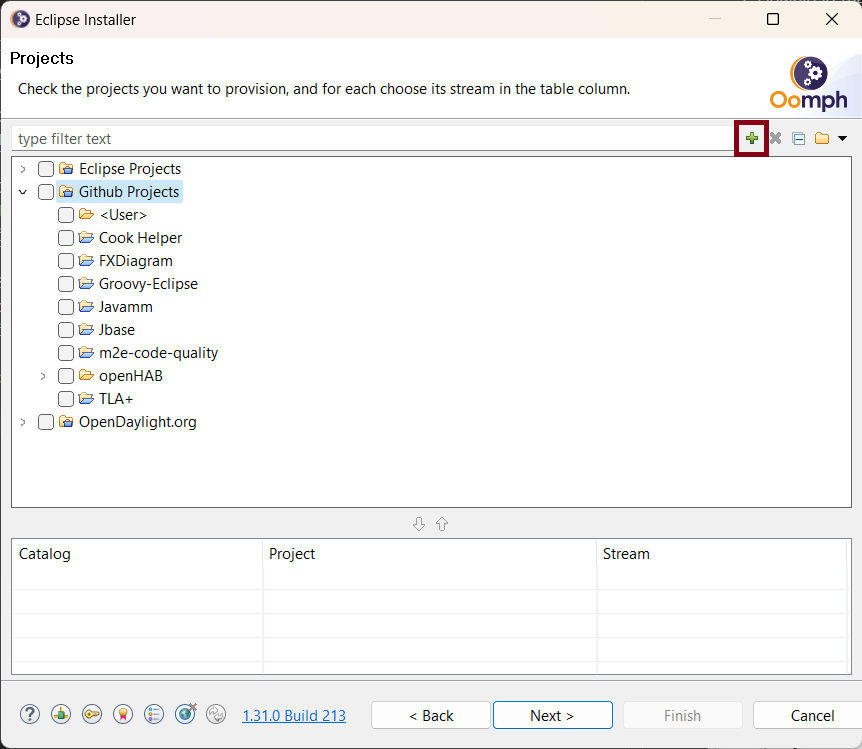
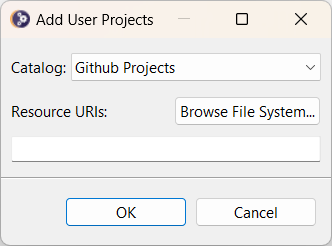
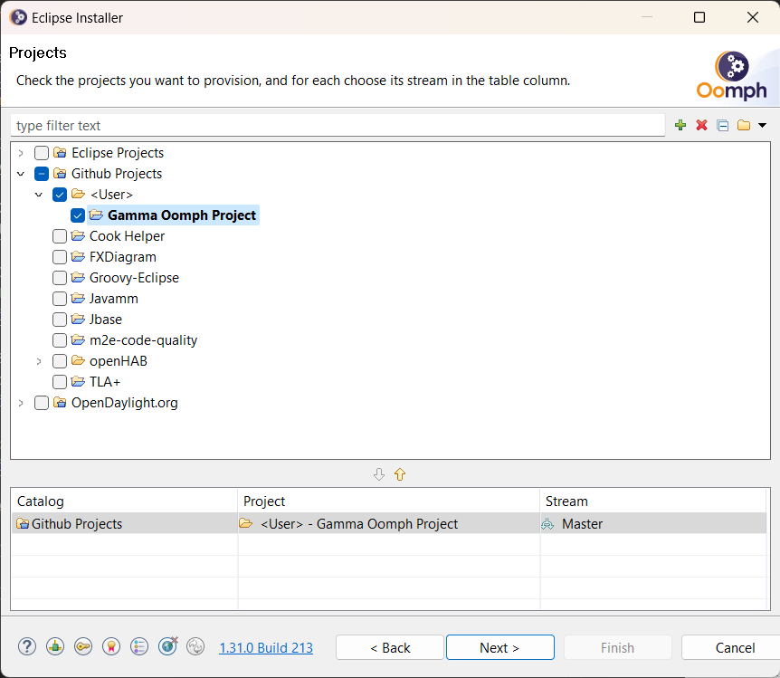

# Installation of 3rd-party Eclipse components using Eclipse Oomph Installer

The `hu.bme.mit.gamma.oomph` project provides a configuration file for the [Eclipse Installer](https://wiki.eclipse.org/Eclipse_Installer) which eases the creation of reproducible development environments. 

1. Download the Eclipse Installer from `https://www.eclipse.org/downloads/packages/installer`.

1. Clone our GitHub repository from using the following URL: `https://github.com/ftsrg/gamma`.
   
1. Open Eclipse Installer and switch to Advanced mode:

1. Select `Eclipse IDE for Java and DSL Developers` with `Product Version`: `2024-09` and `Java VM`: `JRE 17.0.0+` options.

1. Add the [`gamma.setup`](hu.bme.mit.gamma.oomph/gamma.setup) file as a `GitHub User Project`. 

1. Select the `Gamma Oomph Project` to be installed and finish the installation process.

1. At this point you should have an Eclipse with the required 3rd-party Eclipse components. Finish the installation steps described [here](../README.md#installation).