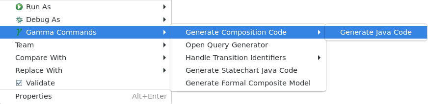

The goal of this tutorial is to try out the Gamma framework for modeling composite architectures and verifying various properties on the architectural design.

## Installation
Install Gamma using the following instructions.

- Download a new Eclipse IDE for [Java and DSL Developers package](https://www.eclipse.org/downloads/packages/release/2023-09/r/eclipse-ide-java-and-dsl-developers).

- Install the following packages. The _Install_ window can be opened via the _Help > Install New Software..._ menu item. In the _Install_ window click _Add..._, and paste the necessary URL in the _Location_ text field. 
  - Install VIATRA 2.8.0 from update site http://download.eclipse.org/viatra/updates/release/2.8.0.
    - Choose the whole _VIATRA Query and Transformation SDK_ package.
  - Install the Yakindu Statechart Tools 3.5.13. from update site http://updates.yakindu.com/statecharts/releases/.
    - From the Yakindu Standard Edition choose _Yakindu Statechart Tools_, _Yakindu Statechart Tools Base_, _Yakindu License Integration For Standard Edition_ and _Yakindu Statechart Tools Java Code Generator_ subpackages in package _Yakindu Statechart Tools Standard Edition_.
  - Install the PlantUML Eclipse Plugin 1.1.30 from update site http://hallvard.github.io/plantuml/.
    - Install all available features apart from _Source_.
    - Some version of the PlantUMl might require Graphviz, you can find more informations [here](../plugins/vis/README.md).
- Exit Eclipse and extract the [Gamma zip file](https://inf.mit.bme.hu/sites/default/files/gamma/2_10_0/gamma-tool-2.10.0.zip) into the root folder of Eclipse. (This will create the _plugins_ directory in the _dropins_ folder, containing the JAR file of the Gamma. If not, make sure you copy all the JAR files contained in the Gamma zip file in the _plugins_ directory of the _dropins_ folder of the root folder of Eclipse.)
- When starting Eclipse for the first time, you might need to start it with the `-clean_` flag.
- Check if the plugin installed successfully in _Help > About Eclipse_ and by clicking _Installation Details_. On the _Plug-ins_ tab, sort the entries by _Plugin-in Id_ and look for entries starting with _hu.bme.mit.gamma_.

_Tip: It is advised to turn on automatic refreshing for the workspace. The other option is to refresh it manually with F5 after every Gamma command._

For formal verification, download and extract [UPPAAL](http://www.uppaal.org/) 5.0.0. In order to let Gamma find the UPPAAL executables, add the bin-Win32 or bin-Linux folder to the path environment variable (depending on the operating system being used).

## Presenting the Models

Download the [Gamma tutorial](https://inf.mit.bme.hu/sites/default/files/gamma/2_10_0/gamma-tutorial-pack-2.10.0.zip), and extract its contents.

In this tutorial, we are going to design the controller of traffic lights in a crossroad. In each direction, the traffic lights are the standard 3-phase lights looping through the red-green-yellow-red sequence. As an extra, there is an interrupted mode that may be triggered by the police - in this state, the traffic lights blink in yellow.

- Import the skeleton of the crossroad model from `hu.bme.mit.gamma.tutorial.start.zip` as an existing project (browse the archive file then click _Finish_).
- You will see a number of existing artifacts, including a JUnit test file in the `/test` folder and various models in subfolders of `/model`.

At this point, the project should contain errors that have to be fixed in the tutorial.

To reduce the complexity of the models, we divide the controller into submodules. For each road, the lights will be controlled by an instance of the _traffic light controller_ statechart (`/model/TrafficLight/TrafficLightCtrl.sct`), while a separate _crossroad controller_ (`/model/Controller/Controller.sct`) will be responsible for the coordination of the flow of traffic.

The models of the controllers should be easy to read. The _traffic light controllers_ start from the _Red_ state and will advance to the next state upon receiving a _toggle_ signal. In this example, we assume that timing comes from the _crossroad controller_ - in the form of such _toggle_ signals. The _crossroad controller_ will react to the passing of time, so that it can decide which traffic light(s) to toggle in the given step. This strategy separates the responsibility of handling the lights (through the _LightCommands_ interface) and coordinating the flow of traffic.

As mentioned before, the police may interrupt the behavior of the crossroad at any time, switching all the lights to a blinking yellow state. This signal is sent through the _crossroad controller_, which will forward it to the _traffic light controllers_ (as the blinking yellow behavior is implemented there).

There is also a monitor component (`/model/Monitor/Monitor.sct`) that can be used later.

After examining the _traffic light controller_ and the _crossroad controller_, you should notice that they have matching interfaces, but the direction of events is the opposite. This is because Gamma works with the concept of _ports_, points of services that can provide or require an interface. An output event on a provided interface will be an output event on a required one, enabling the connection of the two ports with a _channel_.

The interfaces used in the Yakindu statecharts of the controllers are defined separately. Ideally, the definition of the interfaces should be the first step in system design. Gamma supports this idea by letting us define the interfaces in an empty Yakindu statechart, then compiling them into the native modeling language of the tool.

With the interfaces defined and components modeled, the last thing is to describe how the whole system is built. This is done in the textual syntax of Gamma. Open the composite system description in `/model/Crossroad.gcd` (the extension stands for Gamma Composite Definition). You should see the skeleton of a _synchronous composite component_, which you will have to fill in.

To interpret the syntax, observe the following figure, which illustrates the schematic structure of the system. After importing the components, the file declares that we are specifying the _Crossroad_ system, which will consist of a _CrossroadComponent_ defined as follows.

* First, we define the ports of the system. In this case, we wish to _send_ police interrupt signals from the environment (we _require_ someone who implements this interface) and observe the output of the lights of the primary road (we _provide_ the opportunity to observe the lights).
* Then we define the structure of the composite component in three parts:
    * we instantiate components with the following syntax:

    `component <componentID> : <ComponentType>`

    * define which port of which component should implement the ports of the composite component with the following syntax:

    `bind <systemPortID> -> <componentID>.<componentPortID>`

    * connect the ports of subcomponents with channels with the following syntax:

    `channel [<componentID>.<componentPortID>] -o)- [<componentID>.<componentPortID>]`

_Note_: By default, channels are 1-to-1 connections and no port can connect through more than one channel. The only exception is ports that implement a broadcast interface, an interface which has only outgoing events, in provided mode. Such ports may be connected to multiple listeners, ports that implement the broadcast interface in required mode.

_Note_: In this tutorial the synchronous-reactive semantics is utilized, which means that components are executed in cycles (just like the default behavior of Yakindu statecharts), all at the same time. In practice, the order of execution in each cycle is undefined, but this is not a problem, because communication over channels - the only legal way of communication in Gamma - is delayed by one cycle. This way, the causal relationship between the components is well-defined. It is also important to note that Gamma considers the pieces of information passed through channels as signals (or events). In contrast to messages, these signals are synchronous, not queued, not buffered, they have to be processed in the cycle they arrive. One of the consequences is the restriction on multiple source ports for a channel - there is no way in synchronous-reactive semantics to distinguish the source and the signals will overwrite themselves in an undefined order.
Additionally, Gamma supports cascade (also in the synchronous domain) and asynchronous-reactive (messages and message queues) composition as well.

## Compiling the Yakindu Statecharts

Yakindu serves as a frontend to the formal modeling language of Gamma. Therefore, Yakindu statecharts have to be _compiled_. To compile a Yakindu statechart, Gamma first needs the definition of interfaces used in the system.
To generate the interface definitions from the existing empty Yakindu statechart, right-click `/model/Interfaces/Interfaces.sct` and select _Gamma Commands > Compile Interface_. This should generate a new file called _Interfaces.gcd_. Press _F5_ if you do not see the new file or turn on automatic refreshing of the workspace.

To compile the Yakindu statecharts modeling the two types of controllers, Gamma needs to know how to interpret the interfaces found in them. To specify this, we will use Gamma generator models (_.ggen_).

Open `/model/Controller/Controller.ggen` to see what a Gamma generator model does. You will see that the file specifies the Yakindu statechart to map (this is the _name_ of the statechart, which is by default the same as the filename, but can be changed in the properties view), then a series of mappings. For each interface in the Yakindu model, we have to create a port with an interface matching the Yakindu interface _in the specified mode_ (provided or required). In this file, there are two pairs of ports that implement the same interface in the same mode, as well as one that implements the same but in a different mode.

With the specified information, Gamma can now compile the Yakindu statecharts.

Right-click the _.ggen_ files one by one and select _Gamma Commands > Compile Statechart_. This should create a new file for every statechart with the _.gcd_ extension. This is the textual representation of statecharts used internally by Gamma.

## Creating the Composite Model

Finish the _CrossroadComponent_ model in file _Crossroad.gcd_ in accordance with the descriptions and figure presented above. Content assist can be used while editing the model by pressing _Ctrl + Space_.

By this time, none of the files in the `/model` folder should have any error markers.

## Code Generation

Gamma can generate source code for the composite system specified so far. It will reuse the code generated by Yakindu, so let us first generate the implementation of the Yakindu statecharts.

The project already contains the Yakindu generator models (_.sgen_) necessary to generate code from Yakindu statecharts. Editing and saving the statecharts will automatically regenerate the code, but we can also invoke code generation by right-clicking the _.sgen_ files and selecting _Generate Code Artifacts_.

You can also generate the implementation of the statechart by right-clicking on the _.gcd_ files of the compiled statecharts and selecting _Gamma Commands > Generate Statechart Java Code_. 

When Yakindu has finished code generation, let us generate the implementation of the composite system. Right-click on `/model/Crossroad.gcd` and select _Gamma Commands > Generate Source Code > Generate Java Code_.

After building the workspace, the last errors should vanish and the implementation of the crossroad should be in the `/src-gen` folder in various packages.

## Testing

To demonstrate the API of the generated code, there is a prepared test file in the `/test` folder.
The file contains an embedded class (_CommandListener_) which implements a version of the _LightCommands_ interface. Expand the imports to see exatly what is implemented:

    hu.bme.mit.gamma.impl.interfaces.LightCommandsInterface.Listener.Provided

This Java interface is a listener for the output events of the _LightCommands_ interface in _provided_ mode. Other Java interfaces related to the _LightCommands_ interface are as follows.

* _LightCommandsInterface.Listener.Required_: a listener for the output events of the interface in required mode.
* _LightCommandsInterface.Provided_: contains method to raise input events of the interface in provided mode.
* _LightCommandsInterface.Required_: contains method to raise input events of the interface in required mode.

The _CommandListener_ will be used to cache the output events of the system and check them in assertions.
The file also contains an initializer method (_init_), which demonstrates how to instantiate the composite component. Instantiation also initializes the component, but it can be reinitialized if we need to register listeners before starting it.

There are two test cases in the file. The first one (_greenAtStart_) checks if the components initialize correctly: at first, the priority traffic light controller should emit a _displayRed_ signal, while the _crossroad controller_ will send it a _toggle_ signal. This signal arrives in the next cycle, when the priority _traffic light controller_ should raise the _displayGreen_ signal.

Observe the comments to learn what the different methods do. Observe how to reach ports, how to raise events on them, how to register listeners and how to run the component until no more internal signals are left to process. There is also a _runCycle()_ function that executes only a single cycle of the system, but that will leave internal signals in the channels.
The second test case is somewhat more complex and demonstrates the timed behavior of the implementation. Notice that we call the _reset()_ method after registering the listener to reinitialize the component and therefore receive the first entry events as well.

Run the tests by right-clicking the source file and selecting _Run As > Junit Test_. Both tests should be green, but the second one will take more than 3 seconds to run. This is due to the waiting in the test case, which is not scatutorialle to larger tests. The next section will present a way to overcome this problem.

_Note: If the second test fails, try to re-run it a few times. As system timing is not always accurate, there might be more extreme cases when the timers will not trigger when they would normally have to._

## Model Checking

It is time for a deeper analysis of the crossroad model. Gamma can use model checkers to analyze the behavior of composite systems. Currently, the timed model checker UPPAAL is supported as a verification backend.

We have to start by generating the formal model that will be the input of UPPAAL. To do this, right-click on `/model/Crossroad.gcd` and select _Gamma Commands > Generate Formal Composite Model_. This should create two more files, _Crossroad.xml_, which contains a model that can be opened with UPPAAL, and _Crossroad.q_, which contains a number of queries.

For each state in each statechart component, Gamma generates a query that will check if that state is active in any reachable configuration of the system. The queries can be checked in UPPAAL, either as a form of "deep validation", or to obtain a set of test cases. This functionality is reachable via the _Generate Test Set_ button of the GUI.

Model checking of requirements, on the other hand, is an automatic formal verification technique used to exhaustively analyze the possible behaviors of a system and see if a desired behavior is possible to achieve, or a bad behavior can never be executed. We will use this capability to check if the crossroad can get into a state where both directions get a green light.

To specify the requirement, we need to use _temporal logics_. As temporal logic expressions are hard to read and even harder to write, Gamma provides a more intuitive way of formalizing requirements: filtutorialle patterns.

Right-click `/model/Crossroad.gcd` and select _Gamma Commands > Open Query Generator_ to open the requirement specification window. The top-left part of the window will let you select a template. There are five types of templates: _might eventually_, _must eventually_, _might always_, _must always_ and _leads to_. Upon selecting one, the textbox below will show the corresponding temporal logic operator and an English sentence describing the requirement. There is also an example requirement that would be typically formalized this way. The middle part contains one or two textboxes to formalize the condition mentioned in the patterns. The top-right part helps in assembling the condition formula: select something from the drop-down to insert it at the end of the textbox that last had focus. Note that the textboxes are editable, and the user has to take case of parentheses.

The bottom part contains the _Verify_ button - click it after filling the conditions and UPPAAL will check if the model satisfies your requirement or not. Be aware that model checking is performance-intensive, so this operation might take long.
Let us specify the requirement of not having green light in both directions. Using the presented controls, select the _Must always template_ and specify the condition as "not (green for priority and green for secondary at the same time)".
After clicking the verify button, UPPAAL returns with the result that our model fails to satisfy the requirement, meaning that there is actually a way to reach the undesired state of letting vehicles come in from every direction. Fortunately, UPPAAL also computes a counterexample (or example in desirable behaviors), demonstrating how exactly we can reach the bad state.

## Analyzing the Counterexample

The counterexample returned by UPPAAL is not human-readable, and also has a lot of technical details resulting from the generated model, so Gamma will help us decode (_back-annotate_) it. If you check the package explorer again, there is now a _.get_ file in folder `/trace`. This text file contains a more consumable representation of the counterexample in the following format.

As the synchronous-reactive semantics is cycle-based, the file describes the states of the specified component (**component** _componentId_ after the **import** of its containing package at the beginning of the file) in each particular cycle in block **step**:
* In block **act**, there are input events that need to be fed to the system ports in order to trigger the behavior. It can be either an
  * event **raise**,
  * time **elapse** (in miliseconds) between the last and the current cycles, or
  * the **schedul**ing of the component.
* In block **assert**, the state of the component is specified:
  * Lines starting with **raise** list the output events observed on one of the system ports.
  * In block **state** the active state configurations are specified in every component, including complex states.

_Note: In block state variable values can also be specified, but the UPPAAL back-annotator does not take variable values into consideration._

Based on this the problem is related to the _police interrupt_ signal and is detailed below.

1.	The crossroad initializes and the _crossroad controller_ toggles the priority road to enter the _Green_ state.
2.	A police interrupt arrives, gets relayed to the _traffic light controllers_ and switches every light to a blinking yellow state.
3.	Two seconds after initializing, the _crossroad controller_ gets triggered. After sending out the toggle signals, it now thinks that the priority road has switched to the _Yellow_ state, but it is still blinking due to the previous police interrupt.
4.	Another one second is elapsed. The _crossroad controller_ again sends out the toggle signals and now thinks that the priority road has red, while the secondary road got green light.
5.	The policeman changes his mind and sends another interrupt. The signal is relayed to the _traffic light controllers_, returning them into normal operation (priority road green, secondary road red).
6.	Another two second later, the _crossroad controller_ sends a _toggle_ signal to the secondary road believing that it is now turning yellow, but in reality, the _traffic light controllers_ are not synchronized anymore, so it gives green light to the secondary road right in the next cycle when it receives the toggle.

Based on this scenario, we can see that the problem is in the _crossroad controller_. It should also pause switching states when a police interrupt is in effect.

To make sure the counterexample is indeed present in our implementation, Gamma has also generated a test file in `/test-gen`. Open it to observe the contents.

In addition to what we have seen before in our hand-made test cases, the generated tests use a _virtual timer service_ to measure time. This timer will not use the system time to trigger transitions, it rather simulates time flowing in any rate by calling the elapse() method with any amount of time. This is necessary for two reasons. First, using this timer will not pause the test code, so a simulation of one minute will not take longer than a simulation of a millisecond. Secondly, timed counterexamples often represent the corner cases of system behavior, tricky accidents that may happen extremely rarely in real systems. To simulate these cases, we need to have a way for precise simulation of time, e.g., to show that the wrong input in the wrong millisecond can cause great problems.

Run the test cases and make sure they are really present in the implementation. Also notice that we did not have to wait more than a few milliseconds now for the simulation of 5 seconds.

## Fixing the Controller

As mentioned before, the problem is in the _crossroad controller_. As the last step of this tutorial, let us fix it and re-run the analysis. Fix the `/model/Controller/Controller.sct` Yakindu statechart to ensure it stays synchronized after a _police interruption_ is received.

1. Recompile the Yakindu model.
2. Regenerate Java code from the new Crossroad composite model.
3. Regenerate the formal UPPAAL model.
4. Reexecute the formal verification process. If you have done everything correctly, the requirement should now be satisfied.

## Optional Exercises

To practice the use of Gamma, we suggest the following exercises.
1.	Check the Yakindu statechart of the monitor component modeled in `/model/Monitor/Monitor.sct`. The monitor checks the new requirement of not emitting two consecutive _displayRed_ or _displayGreen_ signals (e.g., because the hardware does not support this). Monitors can be used to intervene in case of erroneous behavior (e.g., shut down the system, or take corrective steps), or to model more complex requirements.
2.	Write the Gamma generator model file for the monitor component. Create a new file named `Monitor.ggen` and use the Gamma editor to fill it based on the other files present in the project. You may also rely on content assist.
3.	Generate the implementation of the Monitor with Yakindu.
4.	Using the _.ggen_ file, compile the Monitor statechart.
5.	Edit `/model/Crossroad.gcd` to include the Monitor component in the composite system. Uncomment the corresponding lines.
6.	Generate code for the composite system with the monitor.
7.	Generate the formal model of the composite system with the monitor.
8.	Using the model checking functionality, check if the Monitor can every reach the _Error_ state during normal operation (assuming there is no hardware fault).
9. _Advanced_: Extend the Monitor component with an additional interface. The Monitor should send an error signal when it enters the error state. Do not forget to recompile the interfaces and also the models building on the interface descriptions. Notice the Problems view during the refactoring.
10.	_Advanced_: Create a new composite system (MonitoredCrossroad.gcd) consisting of a CrossroadComponent (defined during the tutorial, without the Monitor) and a Monitor component attached to one of the traffic light outputs and its error port published as a system port. Generate the implementation and the formal model, then check if the Monitor can reach the error state, and also if the crossroad controller can reach the SecondaryPrepares state.
